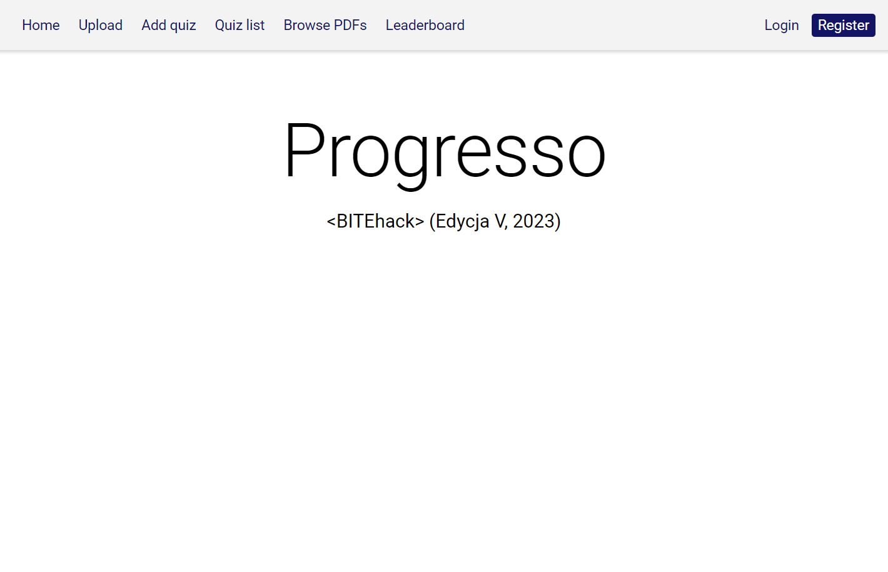
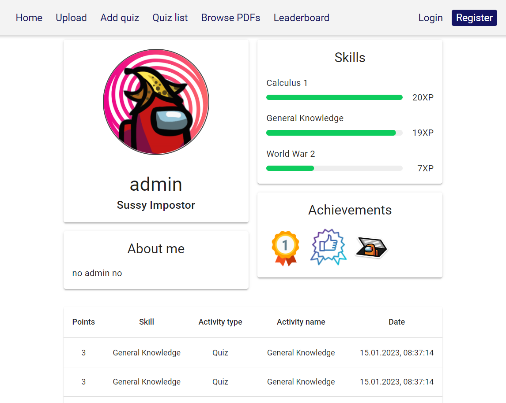
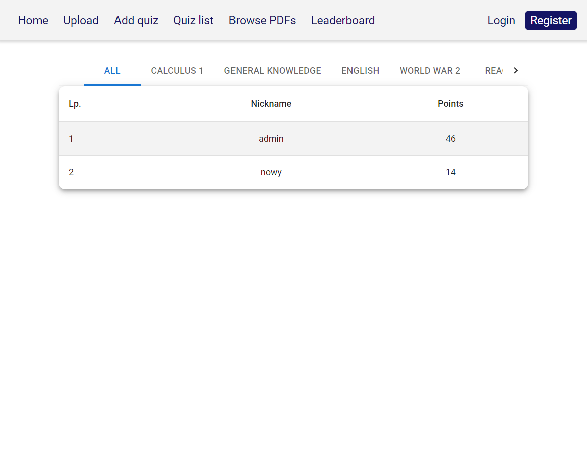
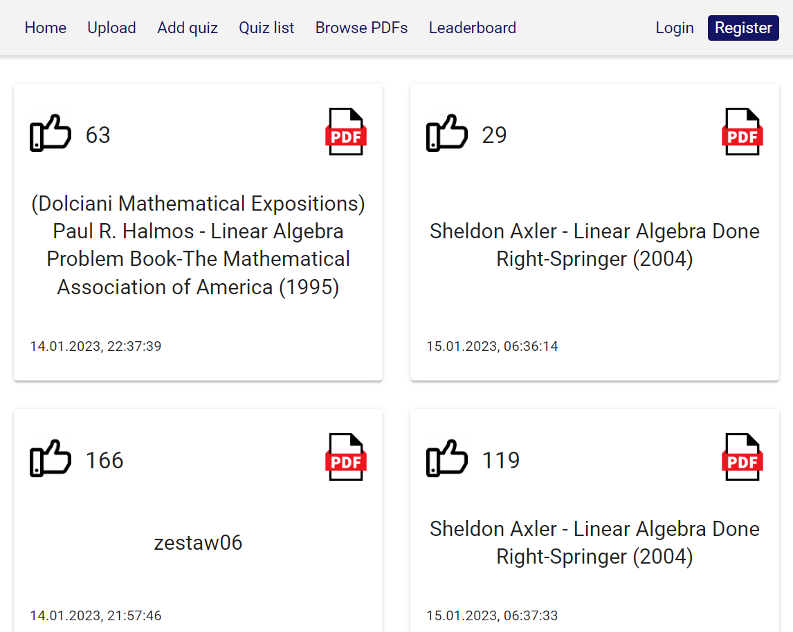
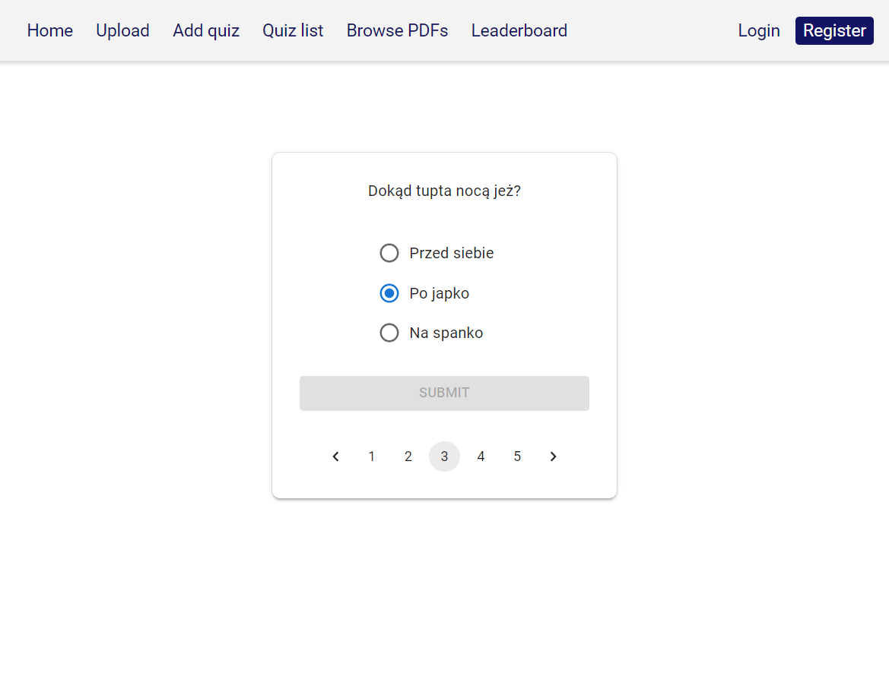

# Progresso

 

**Progresso** is our solution for access to education for everyone. Through gamification, we encourage users to upload and share notes, create and solve quizzes and gain even more experience and achievements in order to climb higher in the leaderboards.
 
## Motivation
Progresso was created at the 5th edition of [BITEhack](https://bitehack.best.krakow.pl/) Hackathon.

- Topic: **Education for all**
- Timeframe: 15-16 January 2023, 24 hours

## Features

- Sign up and log in
- Submit and vote on notes
- Create and complete quizzes
- User profiles
- Achievements
- Leaderboards

## Tech Stack

### Client
  

### Server
   

## Screenshots

## Authors

- [@MSiorr](https://github.com/MSiorr)
- [@rjodlowski](https://github.com/rjodlowski)
- [@rubikon02](https://github.com/rubikon02)
- [@Spookyless](https://github.com/Spookyless)

## License

Both the server and client repositories have their own licenses. Visit each repository's page to learn more about them.

## Acknowledgements

 - [BEST AGH Kraków](http://www.best.krakow.pl/) for organizing the whole event and heartwarming welcome
